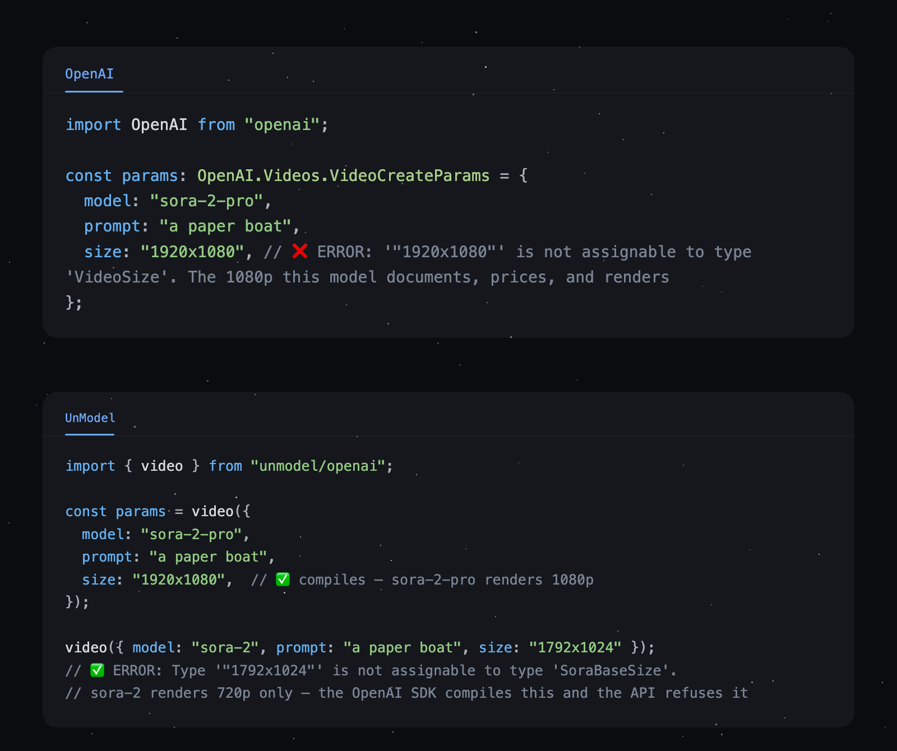

<h1 align="center">unmodel</h1>

<p align="center">
  Type-safe validation and translation for AI API requests — chat, speech, images, video, and music.<br>
  Bring your own SDK or fetch. Your keys never touch it.
</p>

<p align="center">
  <a href="https://www.npmjs.com/package/unmodel"></a>
  <a href="https://github.com/cluely/unmodel/actions/workflows/ci.yml"></a>
  
  =20">
  <a href="LICENSE"></a>
</p>

<p align="center">
  
</p>

unmodel checks your request against what the provider actually accepts, before you send it. Optional cross-provider params compile to real wire bodies. Raw responses get checked for truncation, refusals, filtering, usage, and cost. It never sends anything, never sees a credential. You keep `fetch`, your SDK, and your keys.

Every ❌/✅ in this README is pasted from a real `tsc` run or backed by a test — including the hero image above, where the 400 response is a recorded fixture.

## ✨ Features

- 🎯 **Per-model types** — `background: "transparent"` on `gpt-image-2` is a compile error, not a 400
- 🔤 **Real autocomplete** — the 23 real `gpt-image-2` sizes, all 30 Gemini TTS voices; every list proven by a test
- 🌐 **One vocabulary, fourteen surfaces** — chat, TTS, STT, image, image edit, video, lipsync, avatar, upscale, 3D, music, voice clone, voice design, realtime config
- 🔁 **`.toApi(provider)`** — move a validated chat request to another host serving the same model
- 💸 **Cost gates** — `.safe({ maxCostUSD })` blocks a runaway request before it leaves the process
- 🧾 **Response checks** — truncation, refusals, filtering, usage, and catalog-priced cost from raw payloads
- 🗂️ **Generated [models.dev](https://models.dev) catalog** — capabilities, context limits, pricing, deprecations
- 🪶 **Zero SDK dependency** — types-only entries emit no JavaScript; values entries cost ~1 KiB each
- ⚡ Runs on Node 20+, Bun, and Cloudflare Workers

```sh
npm install unmodel
# or: bun add unmodel
```

## 🚀 Quick start

Write one request, validate it against the selected provider, send the body yourself:

```ts
import { toRequestInit } from "unmodel";
import { chat } from "unmodel/chat";
import { checkChat } from "unmodel/openai";

const request = chat({
  model: "openai/gpt-5.2",
  messages: [{ role: "user", content: "Explain this code in one sentence." }],
  maxOutputTokens: 256,
});

JSON.stringify(request);
// → {"model":"gpt-5.2","messages":[...],"max_completion_tokens":256}

const { url, ...init } = toRequestInit(request);
const response = await fetch(url, {
  ...init,
  headers: {
    ...init.headers,
    authorization: `Bearer ${process.env.OPENAI_API_KEY ?? ""}`,
  },
});

const report = checkChat(await response.json());
report.finishReason; // "stop", "length", ...
report.costUSD;      // actual catalog-priced usage, when available
```

The result *is* the wire body; `toRequestInit` packs URL, method, and static headers for fetch. Auth stays yours — no unmodel export takes a key.

## 🧭 Choose a surface

| Goal | Use | Input |
| --- | --- | --- |
| One shape across providers | `unmodel/chat`, `unmodel/tts`, `unmodel/stt`, etc. | camelCase params + `"provider/model"` |
| Exact provider API | `unmodel/openai`, `unmodel/anthropic`, etc. | provider-native fields + bare model id |
| Small cross-provider bundle | `createChat` from `unmodel/chat/factory`; media factories from their category entries | serves only registered providers |
| Move validated chat to another host | `.toApi(provider)` | an existing validated request |
| [Types with no runtime](docs/types-and-values.md) | `unmodel/<provider>/types`, `unmodel/types` | nothing (the entries emit no JavaScript) |
| [Runtime lists for pickers](docs/types-and-values.md#values) | `unmodel/<provider>/values`, `unmodel/values` | nothing (arrays out, ~1 KiB per import) |

Unified calls compile to provider-native params and finish in that provider's validator:

```text
canonical params → provider wire params → provider validator → fetch or SDK
```

Provider validators take provider-native fields, and the validated result is the exact wire body. Unified model refs split on the first slash: `openrouter/anthropic/claude-opus-5` means provider `openrouter`, model `anthropic/claude-opus-5`.

## 🎨 The fourteen surfaces

| Task | Portable import | Provider-native example |
| --- | --- | --- |
| [💬 Chat](docs/surfaces.md#chat) | `unmodel/chat` | `unmodel/openai`, `unmodel/anthropic`, `unmodel/google` |
| [🗣️ Text to speech](docs/surfaces.md#text-to-speech) | `unmodel/tts` | `unmodel/openai`, `unmodel/elevenlabs`, `unmodel/deepgram` |
| [🎧 Speech to text](docs/surfaces.md#speech-to-text) | `unmodel/stt` | `unmodel/openai`, `unmodel/deepgram`, `unmodel/assemblyai` |
| [🖼️ Image generation](docs/surfaces.md#image-generation) | `unmodel/image` | `unmodel/openai`, `unmodel/google`, `unmodel/black-forest-labs` |
| [✏️ Image editing](docs/surfaces.md#image-editing) | `unmodel/image-edit` | `unmodel/openai`, `unmodel/black-forest-labs`, `unmodel/ideogram` |
| [🎬 Video generation](docs/surfaces.md#video-generation) | `unmodel/video` | `unmodel/openai`, `unmodel/google`, `unmodel/runway` |
| [👄 Lipsync](docs/surfaces.md#lipsync) | `unmodel/lipsync` | `unmodel/fal`, `unmodel/heygen`, `unmodel/sync`, `unmodel/veed` |
| [🧑‍🎤 Avatar](docs/surfaces.md#avatar) | `unmodel/avatar` | `unmodel/fal`, `unmodel/heygen`, `unmodel/sync`, `unmodel/veed` |
| [🔍 Upscale](docs/surfaces.md#upscale) | `unmodel/upscale` | `unmodel/fal`, `unmodel/topaz` |
| [🧊 3D generation](docs/surfaces.md#3d-generation) | `unmodel/3d` | `unmodel/tripo3d`, `unmodel/fal` |
| [🎵 Music generation](docs/surfaces.md#music-generation) | `unmodel/music` | `unmodel/elevenlabs`, `unmodel/fal`, `unmodel/stability` |
| [🎙️ Voice cloning](docs/surfaces.md#voice-cloning) | `unmodel/voice-clone` | `unmodel/elevenlabs`, `unmodel/cartesia`, `unmodel/minimax` |
| [🧪 Voice design](docs/surfaces.md#voice-design) | `unmodel/voice-design` | `unmodel/elevenlabs`, `unmodel/fish-audio`, `unmodel/minimax` |
| [🔌 Realtime audio config](docs/surfaces.md#realtime-audio) | none | `unmodel/openai`, `unmodel/deepgram`, `unmodel/elevenlabs`, etc. |

```ts
import { image } from "unmodel/image";

const request = image({
  model: "openai/gpt-image-2",
  prompt: "a lighthouse in fog",
  aspectRatio: "16:9",
  resolution: "1k",
});
JSON.stringify(request);
// → {"model":"gpt-image-2","prompt":"a lighthouse in fog","size":"1360x768"}

image({ model: "openai/gpt-image-1", prompt: "...", background: "transparent" }); // ✅
image({ model: "openai/gpt-image-2", prompt: "...", background: "transparent" }); // ❌ TypeScript error
```

The four newest surfaces are one line each: a clip, a still, a frame you want bigger, and an object.

```ts
import { lipsync } from "unmodel/lipsync";
import { avatar } from "unmodel/avatar";
import { upscale } from "unmodel/upscale";
import { threeD } from "unmodel/3d";

JSON.stringify(lipsync({ model: "veed/lipsync-2.0", source: { url: clip }, audio: { url: vo } }));
// → {"video_url":"https://ex.com/take.mp4","audio_url":"https://ex.com/vo.wav"}

JSON.stringify(avatar({ model: "fal/fal-ai/sync-lipsync/v3/image-to-video", image: { url: still }, audio: { url: vo } }));
// → {"image_url":"https://ex.com/face.png","audio_url":"https://ex.com/vo.wav"}

JSON.stringify(upscale({ model: "fal/fal-ai/clarity-upscaler", source: { url: still }, factor: 2 }));
// → {"image_url":"https://ex.com/face.png","upscale_factor":2}

JSON.stringify(threeD({ model: "tripo3d/v3.1-20260211", prompt: "a brass astrolabe", seed: 7 }));
// → {"model":"v3.1-20260211","prompt":"a brass astrolabe","model_seed":7}
```

`unmodel/3d` is the first category that shipped with two providers, and on purpose: a 3D
vocabulary read off one vendor would be that vendor's schema with the names changed. The same
model through the aggregator compiles to a different body, which is the comparison it exists
to make cheap.

```ts
JSON.stringify(threeD({ model: "fal/tripo3d/h3.1/image-to-3d", image: { url: still } }));
// → {"image_url":"https://ex.com/face.png"}

JSON.stringify(threeD({ model: "tripo3d/v3.1-20260211", image: { url: still } }));
// → {"model":"v3.1-20260211","input":"https://ex.com/face.png"}
```

Same pattern for every surface — inputs, formats, and extras narrow to the selected model. Per-category guides, including audio input routing, multipart helpers, and voice cloning: [docs/surfaces.md](docs/surfaces.md). Full roster: [docs/providers.md](docs/providers.md); per-provider TTS quirks: [docs/tts.md](docs/tts.md).

## ✅ Validation

Invalid params throw `UnmodelValidationError`. Use `.safe()` to get issues back as values:

```ts
const result = chat.safe({
  model: "openai/gpt-5.2",
  messages: [{ role: "user", content: "Hello!" }],
});

if (result.ok) {
  result.params;   // validated provider body
  result.warnings; // non-fatal validation findings
  result.estimate; // input tokens and worst-case cost, when known
} else {
  result.errors;
}
```

What is checked:

- Shape, unknown fields, enums, and mutually exclusive params
- Model existence, deprecation, capabilities, and per-model exceptions
- Context, input, output, media, and provider-specific limits
- Estimated budget via `maxCostUSD`
- Unsupported or lossy unified translations

`maxCostUSD` turns the estimate into a gate — over budget is an error, not a warning:

```ts
const result = tts.safe({ model: "elevenlabs/eleven_multilingual_v2", text, voice }, { maxCostUSD: 0.01 });
result.ok && result.estimate.costUSD; // 0.0024
```

`.safeUnknown()`, severity options, cost arithmetic, and future model IDs: [docs/validation.md](docs/validation.md).

## 🔁 Retarget chat with `.toApi()`

Move one validated request to another provider that serves the same model:

```ts
import { chat } from "unmodel/anthropic";

const request = chat({
  model: "claude-opus-5",
  max_tokens: 4096,
  thinking: { type: "enabled", budget_tokens: 2048 },
  messages: [{ role: "user", content: "Explain retargeting." }],
});

const moved = request.toApi("openrouter");
moved.model;       // "anthropic/claude-opus-5"
moved.request.url; // https://openrouter.ai/api/v1/chat/completions
moved.warnings;    // id respelling or lossy translations

request.toApi("openai");
//            ~~~~~~~~ TypeScript error: OpenAI does not serve Claude
```

Auth moves with the provider; `CHAT_AUTH` from `unmodel/chat` maps each to its header name and scheme. `.toApiSafe()` is the non-throwing form; details and caveats in [docs/validation.md](docs/validation.md#retarget-chat).

## 🔁 Retarget media with `.toApi("fal")`

The same move for image, video and speech: fal re-serves other vendors' media models, so a validated native request can be sent to fal's queue instead.

```ts
import { video } from "unmodel/kling";

const request = video({
  model_name: "kling-v2-5-turbo",
  prompt: "A slow push-in through a rainy neon alley",
  mode: "pro",
  duration: "10",
});

const onFal = request.toApi("fal");
onFal.request.url; // https://queue.fal.run/fal-ai/kling-video/v2.5-turbo/pro/text-to-video
{ ...onFal };      // { prompt: "A slow push-in…", negative_prompt: "", duration: "10" }
onFal.warnings;    // []  ← empty means the mapping was exact

video({ model_name: "kling-v1", prompt: "…" }).toApi("fal");
//                                             ~~~~~ TypeScript error: fal serves no Kling v1
```

Auth changes with the host — Kling takes `authorization: Bearer <key>`, fal takes `authorization: Key <FAL_KEY>`. A parameter fal cannot express is an error naming it, never a silent drop; a derived or snapped value is one warning. Six families across image, video and tts, with the mappings and the deliberate refusals in [docs/providers.md](docs/providers.md#media-retargeting--toapifal).

## 🧾 Check responses

Provider `check*` helpers inspect raw responses and normalize quality and usage signals:

```ts
import { checkChat } from "unmodel/openai";

const payload = await response.json();
if (!response.ok) throw new Error(`Provider error ${response.status}`);

const report = checkChat(payload);
report.warnings;     // truncation, filtering, refusals
report.finishReason; // normalized finish reason
report.usage;        // input, output, cached, reasoning
report.costUSD;      // actual cost from catalog rates
```

Use the checker from the provider that returned the response; media checkers follow their response documents (`checkImages`, `checkTranscription`, `checkTts`, …) — see [docs/validation.md](docs/validation.md#check-responses).

## 🔡 Types and values

```ts
import type { ChatParams } from "unmodel/types";          // emits no JavaScript at all
import { TTS_MODEL_PARAMS } from "unmodel/openai/values"; // runtime arrays for your <select>, ~1 KiB

TTS_MODEL_PARAMS["gpt-4o-mini-tts"].voices; // the exact array the validator enforces
```

Types-only subpaths ship zero runtime, tested against a real build. Values entries re-export the same objects the adapter compiles with — asserted by `===`, so a picker and the request it builds cannot disagree — and every import's bundle cost is measured and budgeted by a test. Full reference: [docs/types-and-values.md](docs/types-and-values.md).

## 📡 Send with anything

```ts
import OpenAI from "openai";
import { chat } from "unmodel/openai";

const request = chat({ model: "gpt-5.2", messages: [{ role: "user", content: "Hello!" }] });
await new OpenAI().chat.completions.create(request.toSdk("openai"));
```

- `toRequestInit(request)` for JSON + fetch; multipart results redirect you to their `toFormData` helper at compile time
- `.toSdk("openai" | "google" | "google-vertex" | "ai-sdk" | …)` for typed SDK handoff
- Vercel AI SDK via `.toSdk("ai-sdk")`, tools via `withJsonSchemaTools` from `unmodel/ai-sdk`
- WebSocket validators return a ready `wss://` URL or a validated config object

Details: [docs/integrations.md](docs/integrations.md).

## 🗂️ Catalog and CLI

```ts
import { getModel } from "unmodel/catalog";

const model = getModel("openai", "gpt-5.2");
model?.limit.context;
model?.cost?.input;
```

```sh
npx unmodel models openai gpt-5.2
npx unmodel validate openai.chat request.json
npx unmodel validate unified.image image.json --max-cost 0.05
npx unmodel validate unified.stt transcription.json --json
```

`validate` exits non-zero for invalid params. Speech, image, and video catalogs are hand-maintained per provider (`models` from `unmodel/elevenlabs`, …) — see [docs/integrations.md](docs/integrations.md#catalog-and-cli).

## 🏢 Providers

Every implemented provider has its own subpath with native field names, model IDs, routes, pricing, and quirks. Providers whose URL depends on your account expose factories (`createAzure`, `createGoogleVertex`, `createAmazonBedrock`, `createCloudflare`), and `createOpenAICompatible` covers proxies and self-hosted Chat Completions endpoints. Full roster and roadmap: [docs/providers.md](docs/providers.md).

### fal.ai

`unmodel/fal` covers 165 curated endpoints across ten verbs: `image`, `imageEdit`, `video`, `lipsync`, `upscale`, `avatar`, `threeD`, `tts`, `stt`, `music`. Four things here work unlike every other provider.

```ts
import { image } from "unmodel/fal";

const request = image({ endpoint: "fal-ai/flux/dev", prompt: "a cat", image_size: "landscape_4_3" });

JSON.stringify(request);
// → {"prompt":"a cat","image_size":"landscape_4_3"}
request.request.url; // "https://queue.fal.run/fal-ai/flux/dev"
```

- **The model is the route.** The endpoint id is the URL path, so the selector is a pseudo-param named `endpoint`, stripped before the body goes out. It cannot be `model`, because `model` is a real wire field on some fal endpoints. Unified refs are unaffected: `"fal/fal-ai/flux/dev"` splits on the first slash.
- **Every request is a queue submit.** `POST https://queue.fal.run/{endpoint}` answers an envelope (`request_id`, `status`, and the `response_url` / `status_url` / `cancel_url` to follow), not a file. Follow the `response_url` fal hands back, never one you build. Polling stays with your transport code.
- **Auth is `Authorization: Key ${FAL_KEY}`.** The `Key ` prefix is real and fal's own OpenAPI omits it, so unmodel states it in prose rather than deriving it. No unmodel export takes your key.
- **The types are generated from fal's own published OpenAPI.** `bun run codegen:fal` rebuilds `src/providers/fal/gen/` from committed per-endpoint snapshots. Curation, pricing and overlays stay hand-maintained in `data/fal/`, each row carrying a source URL, a date and a quote.

## 📚 Docs

- 📖 [Surfaces guide](docs/surfaces.md) — all fourteen categories, examples, quirks, bundles and custom packs
- ✅ [Validation, cost, and response checks](docs/validation.md)
- 🔡 [Types and values reference](docs/types-and-values.md)
- 🔌 [Integrations: fetch, SDKs, catalog, CLI](docs/integrations.md)
- 🗺️ [Provider roster and roadmap](docs/providers.md)
- 🗣️ [TTS integrator's matrix](docs/tts.md)
- 🏛️ [Architecture decisions](docs/decisions.md)

## 🛠️ Development

```sh
bun install
bun test
bun run check
bun run build
bun run lint:pkg
bun run codegen         # regenerate from the checked-in catalog snapshot
bun run codegen:refresh # refresh models.dev, then regenerate
```

## License

MIT
